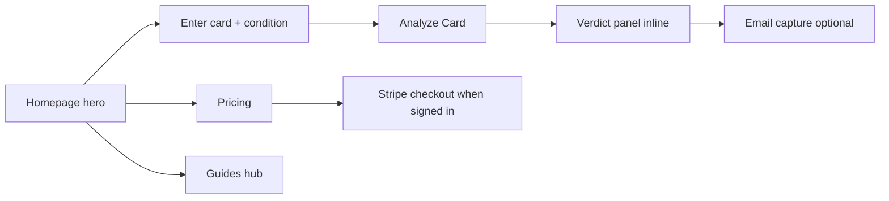

# CardSnap User Flow Audit — 2026-06-01

Live walkthrough of `https://getcardsnap.com` (homepage → scan → pricing/guides). No login required for free scans.

## Flow map

## Homepage → scan (tested: 1989 Upper Deck Ken Griffey Jr., Raw)

| Step | What works | Friction / notes |
|------|------------|------------------|
| Hero + value prop | Clear H1, three outcome bullets, trust section below fold | Trending Topics block is internal content ideas — may confuse visitors ("Insights API not connected") |
| Card input | Placeholder example helps; Analyze enables after fill | No autocomplete — power users ok, new users may typo card names |
| Loading | Button shows progress ("Finding raw card comps") | Good feedback |
| Result | Verdict, raw/PSA9/PSA10, grade recommendation, share link | Strong — answers core question fast |
| Email gate | Optional capture after result | Low friction; checkbox for newsletter is opt-in |
| Data transparency | Methodology + FAQ in trust section | Result says "eBay live comps are not configured" — hurts credibility on that card |

## Pricing (`/pricing`)

| Element | Assessment |
|---------|------------|
| Message | "Stop guessing before you pay to grade" — aligned with product |
| Free tier | "5 free scans" + CTA "Analyze 5 cards free" |
| Pro | Unlimited + break-even math listed clearly |
| Scan packs | $9.99 / $29 / $79 tiers visible |
| Gap | No live Stripe price on page without sign-in — copy says "Stripe shows exact price at checkout" |

## Guides (`/guides`)

| Element | Assessment |
|---------|------------|
| Hub | 40+ guides; sports + Pokémon split |
| SEO | Each card-specific guide targets grading intent |
| Gap | No Griffey / vintage flagship guide in list yet (added in repo 2026-06-01) |

## Priority fixes (ranked)

1. **High** — Resolve or soften "eBay live comps are not configured" on results when comps backend is missing; link to methodology or show data source badge.
2. **Medium** — Hide or relabel "Trending Topics This Week" until Insights API is live (reads as broken placeholder).
3. **Medium** — Add card name autocomplete or recent popular cards chips under search.
4. **Low** — After verdict, single CTA to Pricing when user hits free-scan limit (not tested — needs 6th scan).
5. **Low** — Pricing page: show monthly Pro price on page if Stripe allows public price IDs.

## Conversion hypothesis

The homepage → inline verdict path is strong. Biggest leak is **trust on comp source** when eBay line appears. Fixing data source messaging likely lifts email capture and paid conversion more than hero copy changes.

## Retest checklist

- [ ] Scan with comps configured card — confirm no "not configured" warning
- [ ] Sixth scan — confirm paywall / pricing redirect
- [ ] Mobile: hero form + verdict readability
- [ ] Signed-in checkout — scan pack purchase
